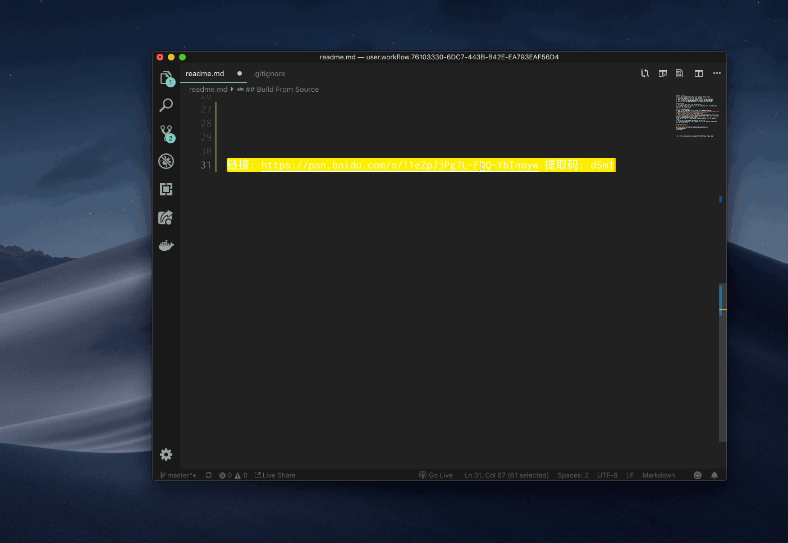

## What is this?
This is an Alfred Workflow which will do these things autoly:
1. parse the baiduyun share link with password
2. open the parsed link in a new browser (controlled by puppeteer)
3. fill it with the parsed password and redirect to download page
4. after u click the download button, the browser will be closed

## Daily Usage
1. Ctrl+Space, then enter `pan <baiduyunLink>`
2. click download link, download will start and the newly created chrome page will be closed autoly

## First-Time Deployment
0. Have Alfred PowerPack, latest Chrome and 百度网盘 installed
1. Download the [BaiduPan.alfredworkflow](https://raw.githubusercontent.com/nendonerd/baiduyunHelper/master/BaiduPan.alfredworkflow)
2. Double click it to add it to Alfred Workflow
3. Ctrl+Space to invoke Alfred, and enter> `pan <baiduyunLink>` e.g. `pan 链接: https://pan.baidu.com/s/1ZFT_AAEAEArG0O22hfKUYQ 提取码: 6ytc 复制这段内容后打开百度网盘手机App，操作更方便哦`
4. hit enter, then it'll open a new chrome window and fill the password field.
5. During first time usage, you have to log in first
6. click download button, then 百度网盘 will pop up, and the chrome page will be closed autoly.

## Build From Source
```
git clone https://github.com/nendonerd/baiduyunHelper.git
cd baiduyunHelper/
yarn install
```